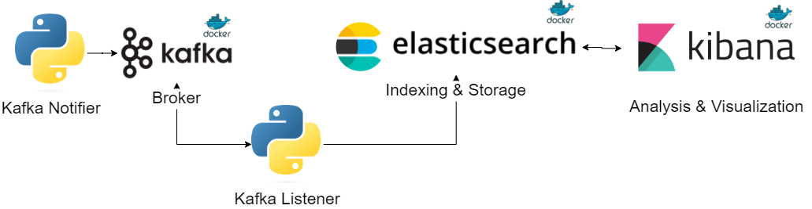

# data-engineer-demo
Demo Docker application with Kafka, Elasticsearch, Kibana and GeoServer

**Install Python dependencies**
1. Copy template and cd to the directory    
`cd /data-engineer-demo`

2. Create a virtual environment    
`python3 -m venv .venv`

3. Activate the virtual environment     
`source .venv/bin/activate`

4. Start develop mode (pip editable mode/ editable install). This will also install the dependencies specified in `pyproject.toml`.   
`python3 -m pip install -e .`

**Running the application**  
5. Open a terminal and run docker-compose.yml
`docker compose up`

6. Open a second terminal and run the Kafka notifier with a topic named `weather`  
`demo notify weather`

7. Open a third terminal and run the Kafka listener on the topic `weather`  
`demo listen weather`  

 

